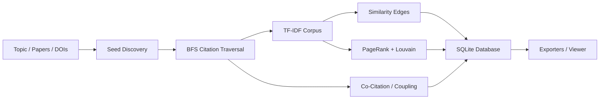

# 📄 PaperGraph

[](https://www.npmjs.com/package/papergraph)
[](https://nodejs.org/)
[](./LICENSE)
[](https://www.typescriptlang.org/)

**Build interactive research-paper connectivity graphs from any topic.**

PaperGraph is a command-line tool that discovers academic papers, traces their citation networks, computes text similarity, runs graph algorithms, and produces explorable visualizations — all from a single command.

### 📦 Install

```bash
npm install -g papergraph
```

Then run:

```bash
papergraph build -t "transformer attention" -o graph.db
papergraph view -i graph.db -o graph.html
open graph.html
```

> **No API keys required** — works out of the box with [OpenAlex](https://openalex.org/) (free, open academic data).

---

## ✨ Motivation

Navigating academic literature is hard. A single topic can span thousands of papers across decades, and understanding *how* they connect — who cites whom, which share methods, which disagree — requires hours of manual work.

PaperGraph automates this:

1. **You provide a topic** (e.g., *"transformer attention mechanisms"*)
2. **It discovers papers** via OpenAlex or Semantic Scholar APIs
3. **It traces citations** through configurable BFS depth
4. **It computes relationships** — text similarity, co-citation, bibliographic coupling
5. **It ranks and clusters** papers using PageRank and Louvain community detection
6. **It produces outputs** — an interactive HTML viewer, JSON, GraphML, GEXF, CSV, or Mermaid diagrams

The result is a navigable knowledge graph that reveals the structure of a research field at a glance.

---

## 🏗️ Architecture

```
┌─────────────────────────────────────────────────────────┐
│                      CLI (Commander)                     │
│   build · export · view · inspect · cache                │
└───────────────┬─────────────────────────────────────────┘
                │
┌───────────────▼─────────────────────────────────────────┐
│                    Graph Builder                         │
│   Orchestrates the full pipeline:                        │
│   seed → traverse → NLP → algorithms → store             │
└──┬───────────┬──────────────┬──────────────┬────────────┘
   │           │              │              │
   ▼           ▼              ▼              ▼
┌──────┐  ┌────────┐   ┌──────────┐   ┌──────────┐
│Source │  │  NLP   │   │  Graph   │   │  SQLite  │
│Adapt.│  │Pipeline│   │  Algos   │   │ Storage  │
├──────┤  ├────────┤   ├──────────┤   ├──────────┤
│OpenAl│  │TF-IDF  │   │PageRank  │   │10 tables │
│  ex  │  │Cosine  │   │Louvain   │   │WAL mode  │
│  S2  │  │Entity  │   │Co-cite   │   │Migrations│
│      │  │Extract │   │Coupling  │   │          │
└──┬───┘  └────────┘   │Scoring   │   └──────────┘
   │                   └──────────┘
   ▼
┌──────────────────┐
│   HTTP Client    │
│  Rate limiting   │
│  Retry + backoff │
│  Token bucket    │
└──────────────────┘
```

### Data Flow



---

## 📁 Project Structure

```
Paper-Graph/
├── src/
│   ├── cli/                  # CLI entry point (Commander)
│   │   └── index.ts          # 5 commands: build, export, view, inspect, cache
│   │
│   ├── builder/              # Graph build orchestrator
│   │   └── graph-builder.ts  # Full pipeline: seed → traverse → NLP → rank → store
│   │
│   ├── sources/              # API data source adapters
│   │   ├── openalex.ts       # OpenAlex API adapter
│   │   ├── semantic-scholar.ts # Semantic Scholar API adapter
│   │   └── utils.ts          # Shared utilities (DOI stripping, title similarity)
│   │
│   ├── nlp/                  # Natural language processing
│   │   ├── tokenizer.ts      # Deterministic tokenization (no stemming)
│   │   ├── stopwords.ts      # 175+ English + academic stopwords
│   │   ├── tfidf.ts          # TF-IDF corpus building + topic relevance
│   │   ├── similarity.ts     # Cosine similarity + edge generation
│   │   └── entity-extraction.ts # Dictionary-based entity extraction
│   │
│   ├── graph/                # Graph algorithms
│   │   ├── algorithms.ts     # PageRank, Louvain, co-citation, coupling
│   │   └── scoring.ts        # Composite ranking (PageRank + relevance + recency)
│   │
│   ├── storage/              # Persistence layer
│   │   └── database.ts       # SQLite via better-sqlite3 (10 tables, WAL mode)
│   │
│   ├── exporters/            # Output format exporters
│   │   └── export.ts         # JSON, GraphML, GEXF, CSV, Mermaid
│   │
│   ├── viewer/               # Interactive visualization
│   │   └── html-viewer.ts    # Self-contained Cytoscape.js HTML viewer
│   │
│   ├── cache/                # API response caching
│   │   └── response-cache.ts # File-system cache with SHA-256 keys + TTL
│   │
│   ├── utils/                # Shared infrastructure
│   │   ├── http-client.ts    # HTTP client with rate limiting + retries
│   │   ├── logger.ts         # Pino-based structured logging
│   │   └── config.ts         # Cosmiconfig configuration resolver
│   │
│   ├── types/                # TypeScript type definitions
│   │   ├── index.ts          # Paper, Edge, Cluster, Entity, Config interfaces
│   │   └── config.ts         # Config types + defaults
│   │
│   └── __tests__/            # Test suites (86 tests)
│
├── dist/                     # Built output (82 KB ESM bundle)
├── package.json
├── tsconfig.json
├── tsup.config.ts
└── vitest.config.ts
```

---

## 🔑 Features

### Data Sources
| Source | API | Rate Limit | Key Required |
|--------|-----|-----------|-------------|
| **OpenAlex** | REST | 10 req/s (polite pool) | Optional (email for polite pool) |
| **Semantic Scholar** | REST | 1 req/s (100 with key) | Optional |

### Graph Spine Strategies
| Spine | Description |
|-------|-------------|
| `citation` | Direct citation links (A cites B) |
| `similarity` | TF-IDF cosine similarity between abstracts |
| `co-citation` | Papers frequently cited together |
| `coupling` | Papers that cite the same references |
| `hybrid` | All of the above combined |

### Graph Algorithms
- **PageRank** — Identifies the most influential papers
- **Louvain** — Community detection for topic clustering
- **Composite Scoring** — Weighted combination of PageRank, relevance, and recency

### Export Formats
| Format | Extension | Use Case |
|--------|-----------|----------|
| JSON | `.json` | Programmatic access, custom visualization |
| GraphML | `.graphml` | yEd, Gephi, NetworkX |
| GEXF | `.gexf` | Gephi (with attributes) |
| CSV | `.csv` | Spreadsheets, pandas |
| Mermaid | `.md` | GitHub/GitLab rendered diagrams |

### Interactive Viewer
- **Cytoscape.js** — force-directed layout
- **Dark glassmorphism** UI with blur effects
- **Cluster coloring** — papers colored by community
- **Node sizing** — scaled by influence score
- **Edge coloring** — by relationship type
- **Search** — real-time filter by title, venue, DOI
- **Neighbor highlighting** — click a paper to highlight connections
- **Detail panel** — paper metadata with DOI/URL links

### NLP Pipeline
- Deterministic TF-IDF (no stemming — reproducible results)
- 175+ stopwords including academic terms
- Cosine similarity with configurable threshold
- Dictionary-based entity extraction (120+ known entities)

### Infrastructure
- **Rate limiting** — per-source token bucket (won't get you banned)
- **Retry logic** — exponential backoff with jitter for 429/5xx errors
- **Response cache** — SHA-256 keyed file-system cache (24h TTL default)
- **SQLite with WAL** — fast concurrent reads, 10-table schema

---

## 🔧 Tech Stack

| Layer | Technology |
|-------|-----------|
| Language | TypeScript (ESM, NodeNext) |
| Runtime | Node.js 20+ |
| CLI | Commander.js |
| HTTP | undici (Node.js built-in HTTP/1.1 & HTTP/2) |
| Database | better-sqlite3 (WAL mode) |
| Graph | graphology + graphology-communities |
| Logging | pino (JSON + pretty-print) |
| Config | cosmiconfig |
| Bundler | tsup |
| Testing | vitest (86 tests, 6 suites) |

---

## 🚀 Quick Start

### Global Install (recommended)

```bash
npm install -g papergraph
papergraph build -t "neural speech enhancement" -d 2 -m 100 -o graph.db
papergraph view -i graph.db -o graph.html
```

### From Source

```bash
git clone https://github.com/DashankaNadeeshanDeSilva/Paper-Graph.git
cd Paper-Graph
npm install
npm run build
node dist/index.js build -t "transformer attention" -o graph.db
```

See **[USAGE.md](./USAGE.md)** for full CLI reference, configuration options, and workflow examples.

---

## 📄 License

MIT
